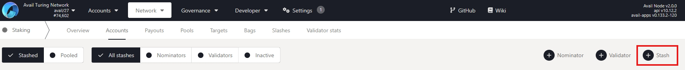
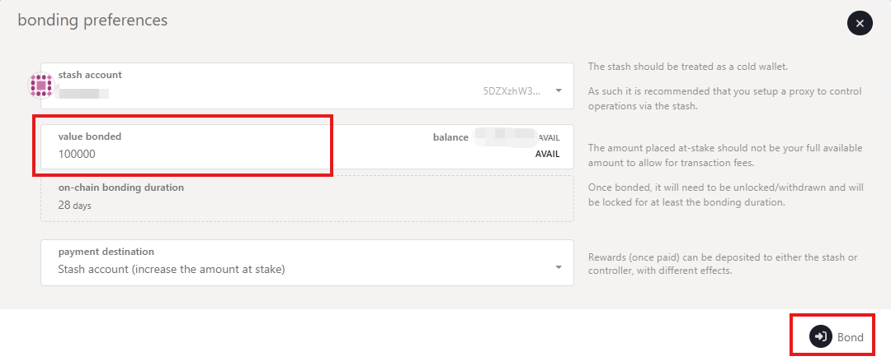
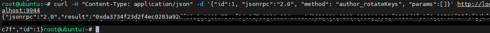
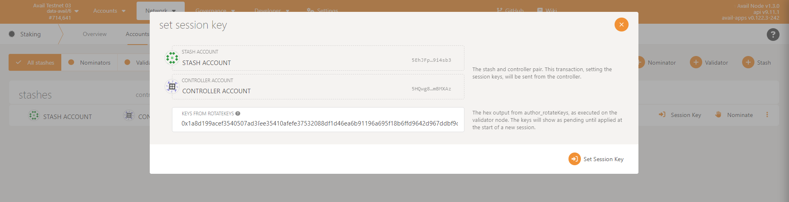
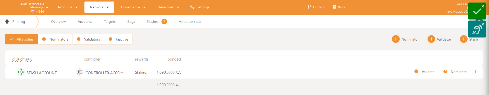
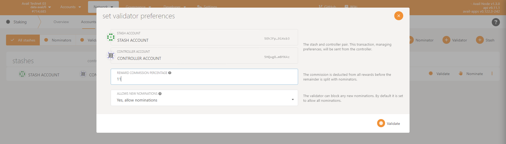
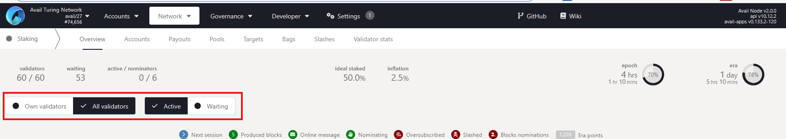

# turing-node-avail
## Guide how to install Turing Avail Node using systemctl

## Auto Install
```
source <(curl -s https://raw.githubusercontent.com/Coha05/turing-node-avail/main/avail-turing-auto.sh)
```
### Update apt & install package dependencies
```
sudo apt update && sudo apt upgrade -y
```
### Create a new directory named "avail"
```
mkdir avail
cd avail
```
### Download the binary
```
wget https://github.com/availproject/avail/releases/download/v2.2.0.0-rc1/x86_64-ubuntu-2204-avail-node.tar.gz
```

### Extract the binary
```
tar -xf /root/avail/x86_64-ubuntu-2204-avail-node.tar.gz 
```

### Create a directory for node data
```
mkdir node-data
```
### Create the service unit file
```
nano /etc/systemd/system/avail.service
```
### Add the following content to the avail-turing.service file
```
[Unit]
Description=Avail Node

[Service]
Type=simple
ExecStart=/root/avail/avail-node --chain turing --name {your-name-here} --validator -d /avail/node-data
Restart=always
RestartSec=3
StandardOutput=syslog
StandardError=syslog
SyslogIdentifier=avail-node

[Install]
WantedBy=multi-user.target

```
### Save and close the file

In nano, you can do this by pressing Ctrl + X, then Y to confirm, and finally Enter to save.

### Reload systemctl and Start the Avail Node service:
```
systemctl daemon-reload
systemctl start avail
systemctl enable avail
```
### Check the status of the Avail Node service
```
systemctl status avail-node
```
Check log: 
```
journalctl -u avail.service
```
or
```
journalctl -u avail.service
```
---

## How to upgrade node

### Go to avail folder and remove the avail node file

```
cd avail
rm -rf avail-node
rm -rf x86_64-ubuntu-2204-avail-node.tar.gz
```
### Download new version and unzip

```
wget https://github.com/availproject/avail/releases/download/v2.2.0.0-rc1/x86_64-ubuntu-2204-avail-node.tar.gz
tar xvzf x86_64-ubuntu-2204-avail-node.tar.gz
```

### Restart your node

```
sudo systemctl restart avail.service
journalctl -f -u avail.service
```
---
## How to connect your node and get into waiting list


### Bond Your Funds

1. Start staking on the Staking page: https://temp-explorer.avail.so/#/staking/actions.
2. Click the `Stash` button to begin bonding.
 
3. Enter your bonding preferences in the form. Then click `Bond` and `Sign and Submit`


**You need at least 100,000 AVL to join waiting list.**

### Get your Session Keys

Run the following command on your node:
```
curl -H "Content-Type: application/json" -d '{"id":1, "jsonrpc":"2.0", "method": "author_rotateKeys", "params":[]}' http://localhost:9944
```

Example result:


### Submit Session Keys

1. Go to [Staking Tab](https://goldberg.avail.tools/#/staking/actions) again
2. Click on Set `Session Key` and enter the hex-encoded result.
3. Click Set `Session Key` and enter your password when prompted.


### Register as a Validator

1. Click `Validate` on the Staking tab.

2. Set your validator commission percentage.
3. Enter your password and click `Validate`.



### Congrats you've made it done

 Check your validator status `Waiting` or `Active` on the `Staking` page [here](https://temp-explorer.avail.so/#/staking)

 

 ---
